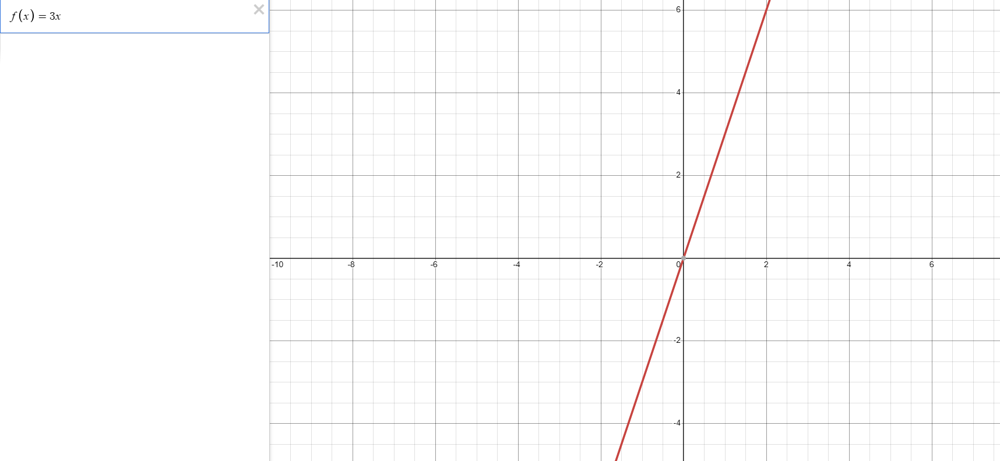

# Simple Functions

This lesson will be covering the basics of functions.
## What you (hopefully) know
You hopefully know what a function is from various math classes over the years. As a refresher, it may look something like this:



This function's y value is always equal to 3 times its x value. Let's see what this would look like in Java.

```java
double f(double x) {
    return x * 3.0;
}
```

The first `double` represents the `return` type. This is to signify that the function `return`s a decimal value. `f` is our name. You would usually use something more descriptive such as `triple`. The `double x` is the argument, we specify type and name. It's the x in f(x). The `{ ... }` shows the inside of the function, anything in here happens when the function is 'called'. `return` is often the final line of functions. That's where you put whatever you want to come out of the function, a `double` in our case. `return` additionally ends a functions processing and 'return's to wherever you call it from. Let's see why we want a `return`.

```java
double startNumber = 6.0;

double endNumber = f(startNumber); // This will evaluate to 18.0
```
This hopefully explains functions. Some more examples are below:

```java
// Return the absolute value of a number
double absoluteValue(double number) {
    double finalNumber = number
    if (number < 0.0) {
        finalNumber *= -1;
    }
    return finalNumber;
}

// Add 1, then divide by 2
double approachOneHalf(double number) {
    double finalNumber = number
    finalNumber += 1;
    finalNumber /= 2;
    return finalNumber;
}

boolean isEven(int number) {
    if (number % 2 == 0) {
        return true; // Notice this return will end the function early, so the return false doesn't happen if the number is even.
    }
    return false;
}

int conjecture(int number) {
    int finalNumber = number;
    if (isEven(number)) { // We can call other functions from within functions
        finalNumber /= 2;
    } else {
        finalNumber *= 3;
        finalNumber -= 1;
    }
    return finalNumber;
}
```